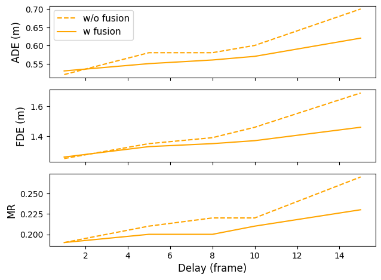

# MSMA

we focus on traffic scenarios where a connected and autonomous vehicle (CAV) serves as the central agent, utilizing both sensors and communication technologies to perceive its surrounding traffics consisting of autonomous vehicles, connected vehicles, and human-driven vehicles.

## Overview


## Gettting Started

1\. Clone this repository:
```
git clone https://github.com/xichennn/MSMA.git
cd MSMA
```

2\. Create a conda environment and install the dependencies:
```
conda create -n MSMA python=3.8
conda activate MSMA
conda install pytorch==1.8.0 cudatoolkit=11.1 -c pytorch -c conda-forge

# install other dependencies
pip install pytorch-lightning
pip install torch-scatter torch-geometric -f https://pytorch-geometric.com/whl/torch-2.1.0+cu121.html
```
3\. Download the [CARLA simulation data](https://drive.google.com/file/d/1bxIS4O1ZF3AvKqnsRTYzy5xg7bVwvL-w/view?usp=drive_link) and move it to the carla_data dir.

## Training
In train.py, There are 3 hyperparameters that control the data processing:
- mpr: determines the mpr of the connected vehicles in the dataset
- delay_frame: determines the latency ranging from 1 to 15 frames (0.1~1.5s)
- noise_var: determines the Gaussian noise variance ranging from 0 to 0.5 \
  
and there are two in the model arguments that control the data fusion:
- commu_only: when set to true, only data from connected vehicles are utilized
- sensor_only: when set to true, only data from AV sensors are utilized \
  when both commu_only and sensor_only are set to False, data from both sources will be integrated

## Results

### Quantitative Results
<p float="left">
    
    
</p>

| Metrics | MPR=0 | MPR=0.2 | MPR=0.4 | MPR=0.6 |MPR=0.8 |
| :--- | :---: | :---: | :---: |:---: |:---: |
| ADE | 0.62 | 0.61 | 0.59 | 0.59 | 0.56 |
| FDE | 1.48 | 1.47 | 1.40 | 1.37 | 1.33 |
| MR | 0.23 | 0.22 | 0.22 | 0.21 | 0.20 |
### Qualitative Results

| MPR=0                  | MPR=0.4                   |MPR=0.8                   |
| -------------------------- | -------------------------- |-------------------------- | 
|    |    |    |

## License

This repository is licensed under [Apache 2.0](LICENSE).
